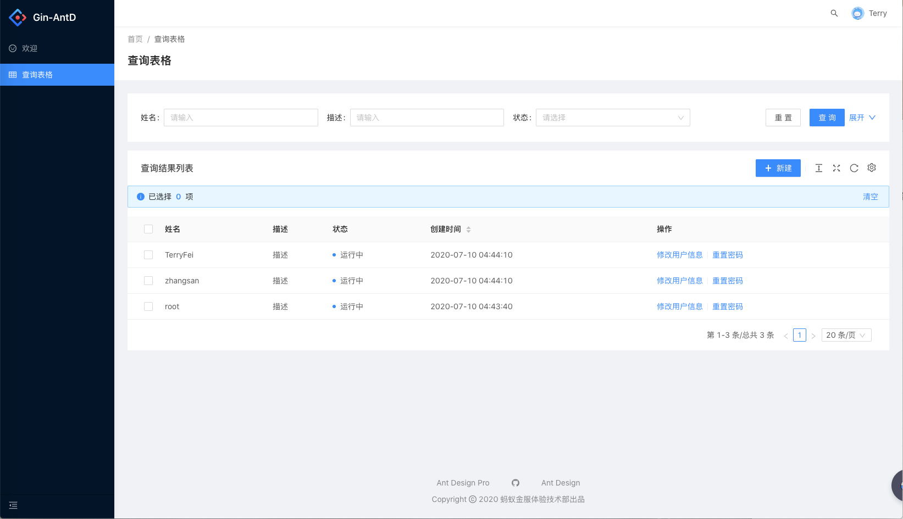
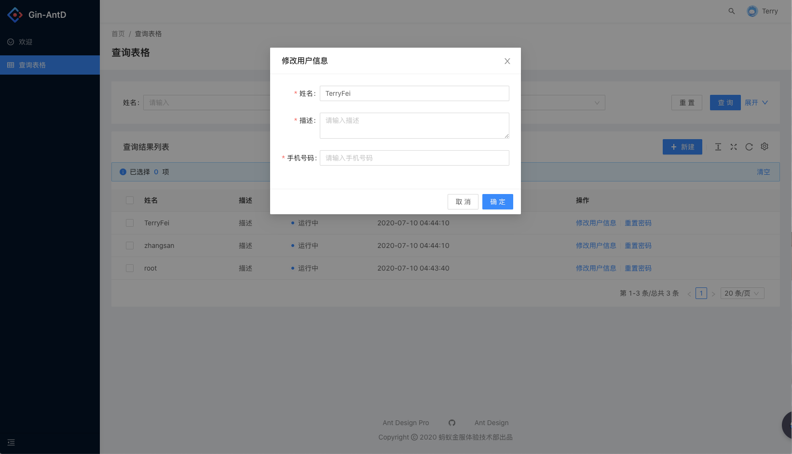
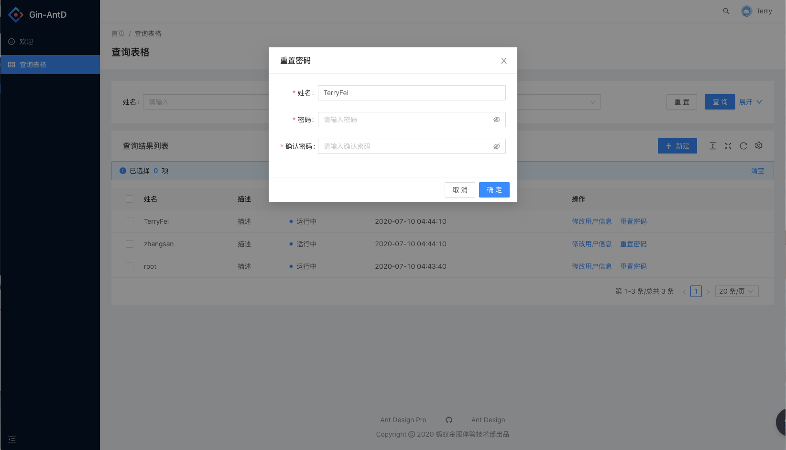
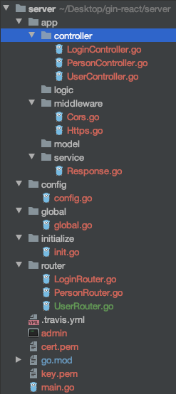

## GinAntD

GinAntD是一套使用Go作为API端的服务，Ant Design Pro作为管理界面的框架，非常容易上手，并且界面美观易用。










测试环境开发：

```
npm install && npm run start
```


生产环境开发：

```
npm run build
```

然后使用 nginx 将 dist 目录部署到域名环境下即可


Go-Server：使用Gin开发，支持多种特性（中间件、模型、路由、服务）等适合作为API开发的架子使用

